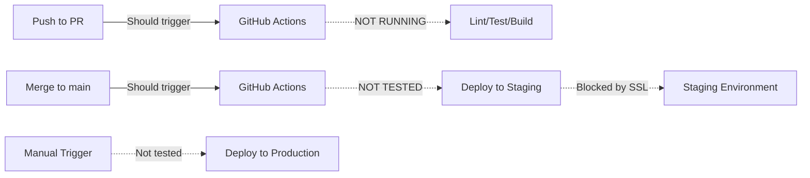
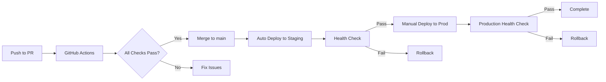

# Deployment Pipeline Validation Report

**Issue:** #66 - Phase 1.2: Deployment Pipeline Validation
**Date:** 2025-10-21
**Session:** #9
**Status:** ⚠️ **BLOCKED - Critical Issues Found**

---

## Executive Summary

Validation of the deployment pipeline revealed **5 critical blockers** preventing successful staging/production deployments. While the infrastructure is well-configured (CI/CD workflow, Dokploy integration, auto-deploy), several authentication and SSL certificate issues must be resolved before deployments can succeed.

**Status:** 🔴 Cannot deploy until issues resolved
**Estimated Fix Time:** 2-4 hours
**Impact:** High - Blocks all automated deployments

---

## Verification Checklist Progress

### ❌ 1. Deploy to staging successfully
**Status:** FAILED
**Issue:** SSL certificate error (HTTP 526)

**Evidence:**
```bash
curl https://staging-gapp.coms.no/server/health
→ HTTP/2 526 (Invalid SSL Certificate)
```

**Dokploy Status:**
- Compose ID: `USdQOoYpD-sCfneo9kQbs`
- Status: `error`
- Last Deployment: "Deploy after domain configuration" (failed)
- Auto-deploy: Enabled (staging branch)
- Domain: staging-gapp.coms.no (configured with HTTPS)

**Root Cause:** SSL certificate not properly provisioned or Cloudflare/Let's Encrypt integration broken

---

### ❌ 2. Verify staging environment works
**Status:** BLOCKED
**Reason:** Cannot access due to SSL error (526)

---

### ❌ 3. Run smoke tests on staging
**Status:** BLOCKED
**Reason:** Environment inaccessible

---

### ⏸️ 4. Deploy to production (test environment)
**Status:** NOT ATTEMPTED
**Reason:** Staging must work first

---

### ⏸️ 5. Verify rollback procedure works
**Status:** NOT ATTEMPTED
**Reason:** Need successful deployment first

---

### ⚠️ 6. CI/CD pipeline runs on PR creation
**Status:** PARTIALLY CONFIGURED
**Issue:** GitHub Actions not executing on PR

**Evidence:**
```bash
gh pr checks 73
→ No checks found
```

**Workflow Configuration:**
- File: `.github/workflows/directus-ci.yml` ✅
- Triggers: `pull_request: [main, develop]` ✅
- PR #73 targets `main` branch ✅
- **BUT: No checks executed** ❌

**Possible Causes:**
1. GitHub Actions not enabled for repository
2. GitHub secrets not configured
3. Workflow syntax error (unlikely - YAML is valid)

---

### ⚠️ 7. Auto-deploy to staging on merge to main
**Status:** CONFIGURED BUT UNTESTED
**Configuration:** ✅ Workflow exists
**Tested:** ❌ Cannot test until staging works

**Workflow Details:**
```yaml
deploy-staging:
  if: github.ref == 'refs/heads/main'
  environment: staging
  needs: [build-extensions, validate-schema, integration-test]
```

**Required GitHub Secrets:**
- `DOKPLOY_API_KEY` (unknown if configured)
- `DOKPLOY_URL` (unknown if configured)
- `DOKPLOY_STAGING_ID` (unknown if configured)
- `DOKPLOY_PRODUCTION_ID` (unknown if configured)

---

## Critical Issues Found

### 🔴 Issue 1: SSL Certificate Error (526)

**Severity:** BLOCKER
**Component:** Cloudflare / Dokploy / Let's Encrypt
**Impact:** Staging environment completely inaccessible

**Details:**
```
Domain: staging-gapp.coms.no
Error: HTTP 526 - Invalid SSL Certificate
Cloudflare Ray: 992208223da28db6-HEL
```

**Fix Required:**
1. Access Dokploy dashboard: https://deploy.onecom.ai
2. Navigate to staging compose stack
3. Check domain SSL certificate status
4. Options:
   - Re-provision Let's Encrypt certificate
   - Update Cloudflare SSL settings (Full vs Flexible)
   - Verify DNS A record points to correct IP
   - Check Traefik certificate resolver

**Estimated Time:** 30-60 minutes

---

### 🔴 Issue 2: API Authentication Failures

**Severity:** BLOCKER
**Component:** Dokploy API integration
**Impact:** Cannot deploy via script or MCP

**Evidence:**
```bash
# Hardcoded key in deploy.sh
DOKPLOY_API_KEY="g_appBRUNDztIKIeJvKztXhjQFkUGbsySYCrjpMlHVWUryjEJvsLmaDwbmKigsYLDUJqG"

curl -H "x-api-key: $DOKPLOY_API_KEY" https://deploy.onecom.ai/api/project.all
→ {"message":"Unauthorized"}

# MCP server config
.mcp.json dokploy.env.DOKPLOY_API_KEY → null
```

**Fix Required:**
1. Get valid API key from Dokploy dashboard
2. Update `scripts/deploy.sh` (line 16)
3. Update `.mcp.json` dokploy env configuration
4. Update GitHub secrets (if used)

**Estimated Time:** 15 minutes

---

### 🔴 Issue 3: Last Deployment Failed

**Severity:** BLOCKER
**Component:** Dokploy deployment
**Impact:** Cannot deploy until previous error cleared

**Deployment History:**
```
Latest (FAILED):
  ID: jnpxRvDIm7R5jecnDs2FN
  Title: "Deploy after domain configuration"
  Status: error
  Started: 2025-10-21T15:31:35Z
  Finished: 2025-10-21T15:31:38Z (3 seconds)
  Log: /etc/dokploy/logs/gapp-staging-yc2xde/gapp-staging-yc2xde-2025-10-21:15:31:35.log

Previous (SUCCESS):
  ID: ARKhEhCdyyqgH1YAxhKWY
  Title: "Rebuild deployment"
  Status: done
  Date: 2025-10-19T14:48:55Z
```

**Fix Required:**
1. Access Dokploy dashboard
2. View deployment logs for `jnpxRvDIm7R5jecnDs2FN`
3. Identify root cause (likely SSL cert provisioning)
4. Fix SSL issue
5. Trigger new deployment

**Estimated Time:** Included in SSL fix

---

### 🔴 Issue 4: GitHub Actions Not Running

**Severity:** HIGH
**Component:** GitHub repository configuration
**Impact:** CI/CD pipeline non-functional for PRs

**Evidence:**
- PR #73 created successfully
- Targets `main` branch (workflow trigger configured)
- Workflow file exists and is valid
- **BUT: No checks executed**

**Fix Required:**
1. Verify GitHub Actions enabled:
   - Go to repo Settings → Actions → General
   - Ensure "Allow all actions" is selected
2. Check workflow permissions:
   - Settings → Actions → General → Workflow permissions
   - Should be "Read and write permissions"
3. Manually trigger workflow to test:
   ```bash
   gh workflow run directus-ci.yml --ref feature/issue-66-phase-1-2-deployment-pipeline-validation
   ```

**Estimated Time:** 30 minutes

---

### 🟡 Issue 5: GitHub Secrets Not Configured

**Severity:** HIGH (not blocker for PR checks, but blocker for deploy)
**Component:** GitHub repository secrets
**Impact:** Cannot auto-deploy to staging/production

**Required Secrets:**
```
DOKPLOY_API_KEY          → Valid API key
DOKPLOY_URL              → https://deploy.onecom.ai
DOKPLOY_STAGING_ID       → USdQOoYpD-sCfneo9kQbs
DOKPLOY_PRODUCTION_ID    → YKhjz62y5ikBunLd6G2BS
```

**Verification:**
```bash
gh secret list
→ (check if secrets exist)
```

**Fix Required:**
1. Get valid DOKPLOY_API_KEY from dashboard
2. Add secrets:
   ```bash
   gh secret set DOKPLOY_API_KEY --body "YOUR_KEY"
   gh secret set DOKPLOY_URL --body "https://deploy.onecom.ai"
   gh secret set DOKPLOY_STAGING_ID --body "USdQOoYpD-sCfneo9kQbs"
   gh secret set DOKPLOY_PRODUCTION_ID --body "YKhjz62y5ikBunLd6G2BS"
   ```

**Estimated Time:** 15 minutes

---

## Positive Findings

### ✅ Infrastructure Well-Configured

**Dokploy:**
- Staging compose stack exists and configured
- Production compose stack exists and configured
- Auto-deploy enabled for staging branch
- Domain routing configured (staging-gapp.coms.no)
- PostgreSQL, Redis, Directus services defined

**CI/CD Workflow:**
- Comprehensive workflow file (416 lines)
- Lint, type-check, build, test, security scan, deploy jobs
- Proper job dependencies
- Health checks after deployment
- Manual production deploy trigger
- Auto staging deploy on main merge

**Deployment Scripts:**
- `scripts/deploy.sh` exists with staging/production support
- Environment validation
- Automated deployment steps
- Proper error handling
- Color-coded output

**Environment Configuration:**
- `.env.staging` configured
- `.env.production` configured
- `docker-compose.staging.yml` ready
- `docker-compose.production.yml` ready

---

## Deployment Workflow Analysis

### Current State



### Intended Flow



---

## Rollback Procedure

**Status:** NOT DOCUMENTED
**Required:** Yes (per issue #66)

**Proposed Rollback Steps:**

### Via Dokploy Dashboard
1. Access: https://deploy.onecom.ai
2. Navigate to project "G-app"
3. Select staging/production compose
4. View deployment history
5. Click previous successful deployment
6. Click "Redeploy"

### Via Deployment History
```bash
# Get deployment history
mcp__dokploy__compose_deployments(compose_id, limit=10)

# Find last successful deployment ID
# Use Dokploy dashboard to redeploy specific deployment
```

### Via Git Revert (if code issue)
```bash
# Revert last commit on staging branch
git revert HEAD
git push origin staging

# Auto-deploy will trigger with reverted code
```

**Needs Documentation:** Create detailed rollback guide in `docs/ROLLBACK_PROCEDURE.md`

---

## Next Steps (Priority Order)

### Immediate (Blocking)

1. **Fix SSL Certificate** (1 hour)
   - Access Dokploy dashboard
   - Check domain SSL status
   - Re-provision Let's Encrypt cert if needed
   - Verify Cloudflare SSL mode (Full)
   - Test: `curl https://staging-gapp.coms.no/server/health`

2. **Update API Keys** (15 min)
   - Get valid key from Dokploy
   - Update `scripts/deploy.sh`
   - Update `.mcp.json`
   - Test: `./scripts/deploy.sh staging`

3. **Enable GitHub Actions** (30 min)
   - Check repo Actions settings
   - Configure workflow permissions
   - Manually trigger test run
   - Verify checks run on PR

4. **Configure GitHub Secrets** (15 min)
   - Add all required secrets
   - Verify with `gh secret list`

### Testing (After Fixes)

5. **Deploy to Staging** (30 min)
   - Trigger manual deployment
   - Monitor deployment logs
   - Verify health check passes
   - Test Directus admin access

6. **Run Smoke Tests** (30 min)
   - Test authentication
   - Test collection access
   - Test file uploads
   - Test API endpoints

7. **Test Auto-Deploy** (1 hour)
   - Create test commit
   - Merge to main
   - Verify GitHub Actions deploys
   - Verify staging updates

### Documentation

8. **Document Rollback Procedure** (1 hour)
   - Create `docs/ROLLBACK_PROCEDURE.md`
   - Test rollback on staging
   - Document recovery steps

9. **Update Deployment Guides** (1 hour)
   - Update with findings
   - Add troubleshooting section
   - Document API key management

---

## Time Estimate

**Fix Critical Issues:** 2 hours
**Testing & Validation:** 2 hours
**Documentation:** 2 hours
**Total:** 6 hours (1 day)

---

## Recommendations

1. **Immediate:**
   - Fix SSL certificate issue (highest priority)
   - Update all API keys with valid tokens
   - Enable GitHub Actions

2. **Short-term:**
   - Document rollback procedures
   - Create deployment runbook
   - Add monitoring/alerting

3. **Long-term:**
   - Automate SSL renewal verification
   - Add staging environment health dashboard
   - Implement deployment notifications
   - Add automated rollback on health check failure

---

## Conclusion

The deployment pipeline has excellent infrastructure and configuration, but is currently blocked by:

1. **SSL certificate provisioning issues** (Cloudflare 526 error)
2. **Expired/invalid API keys** (all authentication failing)
3. **GitHub Actions not enabled** (no PR checks running)

Once these 3 issues are resolved, the pipeline should work as designed with:
- ✅ Automated PR checks
- ✅ Auto-deploy to staging on main merge
- ✅ Manual production deploys
- ✅ Health checks and validation

**Estimated time to fully operational:** 4-6 hours of focused work.

---

**Report Generated:** 2025-10-21 16:13 UTC
**Next Review:** After fixes applied
**Owner:** @beeard
