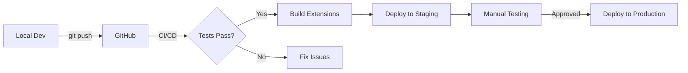

# DirectApp - Development Workflow

Complete development workflow for DirectApp with Dokploy integration.

**Last Updated:** 2025-10-21

---

## Quick Start

```bash
# 1. Clone repository
git clone https://github.com/gumpen-app/directapp.git
cd directapp

# 2. Start local development
pnpm dev

# 3. Access Directus admin
open http://localhost:8055/admin

# 4. Develop extensions (hot reload)
pnpm extensions:dev
```

---

## Development Environment

### Local Setup (Recommended)

**Using Docker Compose:**

```bash
# Start all services
pnpm dev

# Or manually:
docker compose -f docker-compose.dev.yml up

# Stop services
pnpm dev:down

# View logs
pnpm dev:logs
```

**Services:**
- **Directus**: http://localhost:8055
- **PostgreSQL**: localhost:5432
- **Redis**: localhost:6379

**Default credentials:**
- Email: `admin@dev.local`
- Password: `admin`

### Extension Development

Extensions have **hot reload** enabled in development mode.

```bash
# Start extension development (watch mode)
cd extensions
pnpm dev

# Build extensions for deployment
pnpm build

# Lint extensions
pnpm lint

# Type check
pnpm type-check
```

**Hot reload workflow:**
1. Edit extension code in `extensions/your-extension/`
2. Changes detected automatically
3. Extension rebuilds
4. Reload Directus admin to see changes

---

## Deployment Pipeline

### Overview

```
Local Dev → Git Push → CI/CD → Staging (auto) → Production (manual)
```

### Deployment Flow



### 1. Local Development

Make changes locally:

```bash
# Start dev environment
pnpm dev

# Develop extensions
cd extensions
pnpm dev

# Make changes to code
# Test in local Directus
```

### 2. Pre-commit Validation

Before committing, pre-commit hook runs:

```bash
git add .
git commit -m "feat: add new feature"

# Pre-commit hook runs automatically:
# ✓ Secret detection
# ✓ Extension linting
# ✓ Type checking
# ✓ Schema validation
```

**Hook location:** `.git/hooks/pre-commit`

### 3. Push to GitHub

```bash
git push origin main
```

This triggers CI/CD pipeline.

### 4. CI/CD Pipeline

**Runs automatically on push to main:**

1. **Lint & Type Check** (2 min)
   - ESLint on extensions
   - TypeScript type check

2. **Build Extensions** (3 min)
   - Build all extensions
   - Create artifacts

3. **Validate Schema** (1 min)
   - Check schema snapshots
   - Validate permissions

4. **Integration Tests** (5 min)
   - Ephemeral Directus instance
   - Test extensions
   - Test API endpoints

5. **Security Scan** (2 min)
   - Trivy vulnerability scan
   - Secret detection

6. **Deploy to Staging** (auto, 2 min)
   - Upload extension artifacts
   - Trigger Dokploy deployment
   - Health check

**Total time:** ~15 minutes

### 5. Staging Testing

**Staging URL:** https://staging-gapp.coms.no/admin

**Test:**
- Extensions work correctly
- Schema migrations applied
- Workflows function properly
- No errors in logs

### 6. Production Deployment

**Manual trigger only:**

```bash
# Option 1: Via GitHub Actions
# Go to: Actions → DirectApp CI/CD → Run workflow → Select main → Run

# Option 2: Via CLI script
pnpm deploy:production

# Option 3: Via workflow command
/deploy production
```

**Production URL:** https://gapp.coms.no/admin

---

## Schema Management

### Workflow

```
Local Changes → Export → Staging → Test → Production
```

### Export Schema from Local

```bash
# Export current schema
pnpm sync-schema export local

# Creates: schema/snapshots/local.json
```

### Sync to Staging

```bash
# Sync local schema to staging
pnpm sync-schema local staging

# Or use workflow command:
/sync-schema local staging
```

### Sync to Production

```bash
# Sync staging schema to production (requires confirmation)
pnpm sync-schema staging production

# Or:
/sync-schema staging production
```

### Compare Schemas

```bash
# Show differences
pnpm sync-schema diff local staging
```

---

## Environment Management

### Environments

| Environment | URL | Database | Purpose |
|------------|-----|----------|---------|
| **Local** | localhost:8055 | `directapp_dev` | Development |
| **Staging** | staging-gapp.coms.no | `directapp_staging` | Testing |
| **Production** | gapp.coms.no | `directapp_production` | Live |

### Environment Variables

Each environment has its own `.env` file:

```
.env.development.example  → .env (local)
.env.staging              → Dokploy staging
.env.production.example   → Dokploy production
```

**Required variables:**
- `DIRECTUS_KEY` - Security key
- `DIRECTUS_SECRET` - Security secret
- `DB_PASSWORD` - Database password
- `PUBLIC_URL` - Full HTTPS URL

**Get from Dokploy:**
- Dokploy UI → Project → Service → Environment

### Data Isolation

Each environment has:
- ✅ Separate PostgreSQL database
- ✅ Separate Redis instance
- ✅ Separate S3 bucket (staging/production)
- ✅ Separate backups

**No data sharing** between environments.

---

## Workflow Commands

### Available Commands

```bash
# Deployment
/deploy staging       # Deploy to staging
/deploy production    # Deploy to production

# Schema sync
/sync-schema local staging           # Sync schema
/sync-schema export local            # Export only
/sync-schema diff local staging      # Show diff

# Development (from .claude/commands/)
/work                 # Start working on task
/done                 # Finish task, create PR
/status               # Check project status
/check                # Pre-deployment validation
```

### Using Workflow Commands

Commands are defined in `.claude/commands/`

Example workflow:

```bash
# 1. Start working
/work 142

# 2. Make changes
# ... code changes ...

# 3. Check status
/status

# 4. Finish and create PR
/done
```

---

## Testing

### Local Testing

```bash
# Start dev environment
pnpm dev

# Test in browser
open http://localhost:8055/admin

# Check logs
docker logs directapp-dev

# Database access
psql -h localhost -U directus -d directapp_dev
```

### Staging Testing

```bash
# Deploy to staging
pnpm deploy:staging

# Access staging
open https://staging-gapp.coms.no/admin

# Seed sample data
pnpm seed:staging

# Test workflows
# ... manual testing ...
```

### Integration Tests

```bash
# Run in CI automatically
# Or locally with Docker:

docker compose -f docker-compose.test.yml up
```

---

## Database Operations

### Backup

```bash
# Local backup
pnpm db:backup

# Creates: backup-YYYYMMDD.sql

# Staging/Production backup
# Automatic via Dokploy backup service
# Location: ../files/backups/
```

### Restore

```bash
# Local restore
pnpm db:restore

# Staging/Production restore
# Via Dokploy UI or manual psql
```

### Migrations

Schema migrations run automatically on deployment:

```bash
# Directus detects schema changes
# Applies migrations on startup
# Check logs for errors
```

---

## Monitoring

### Logs

**Local:**
```bash
pnpm dev:logs
```

**Staging/Production:**
- Dokploy UI → Service → Logs
- Or: `docker logs directapp` (on server)

### Health Checks

```bash
# Local
curl http://localhost:8055/server/health

# Staging
curl https://staging-gapp.coms.no/server/health

# Production
curl https://gapp.coms.no/server/health
```

### Error Monitoring

**Sentry (optional):**
- Set `SENTRY_DSN` in environment variables
- Errors sent automatically
- View in Sentry dashboard

---

## Troubleshooting

### Extensions Not Loading

**Problem:** Extensions not appearing in Directus

**Solutions:**
1. Check extension built: `ls extensions/*/dist`
2. Restart Directus: `docker restart directapp-dev`
3. Clear browser cache
4. Check logs: `docker logs directapp-dev`

### Database Connection Error

**Problem:** Directus can't connect to database

**Solutions:**
1. Check PostgreSQL running: `docker ps | grep postgres`
2. Check credentials in `.env`
3. Check database exists: `psql -h localhost -U directus -l`

### Port Already in Use

**Problem:** `Error: Port 8055 already in use`

**Solutions:**
```bash
# Find process using port
lsof -i :8055

# Kill process
kill -9 <PID>

# Or use different port in docker-compose.dev.yml
```

### Schema Sync Fails

**Problem:** Schema sync returns error

**Solutions:**
1. Check admin token is valid
2. Verify target environment is running
3. Check schema JSON is valid: `jq empty schema/snapshots/local.json`
4. Review schema diff first

---

## Best Practices

### Development

1. ✅ Always test locally first
2. ✅ Use hot reload for extensions
3. ✅ Commit often with clear messages
4. ✅ Run pre-commit checks
5. ✅ Export schema regularly

### Deployment

1. ✅ Test in staging before production
2. ✅ Review CI/CD logs
3. ✅ Verify health checks pass
4. ✅ Monitor error logs after deploy
5. ✅ Have rollback plan ready

### Schema Changes

1. ✅ Export schema before changes
2. ✅ Test migrations in staging
3. ✅ Document breaking changes
4. ✅ Sync to production during low traffic
5. ✅ Keep backup before schema sync

### Security

1. ✅ Never commit .env files
2. ✅ Use strong passwords (20+ chars)
3. ✅ Rotate secrets quarterly
4. ✅ Enable 2FA for admin accounts
5. ✅ Review permissions regularly

---

## Additional Resources

- [DNS Setup Guide](./DNS_SETUP.md)
- [Dokploy Deployment Guide](../DOKPLOY_DEPLOYMENT_GUIDE.md)
- [Production Roadmap](../.claude/PRODUCTION_ROADMAP.md)
- [Schema Analysis](../.claude/SCHEMA_ANALYSIS.md)

---

**Questions?** Create an [issue](https://github.com/gumpen-app/directapp/issues) or check the docs.
